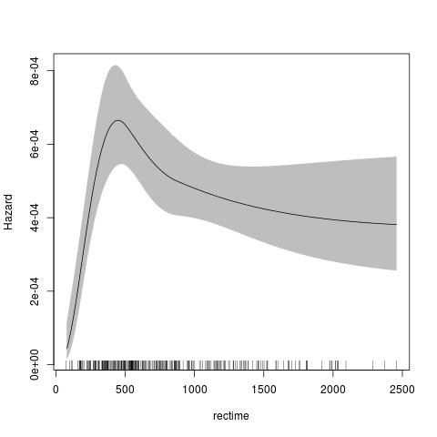
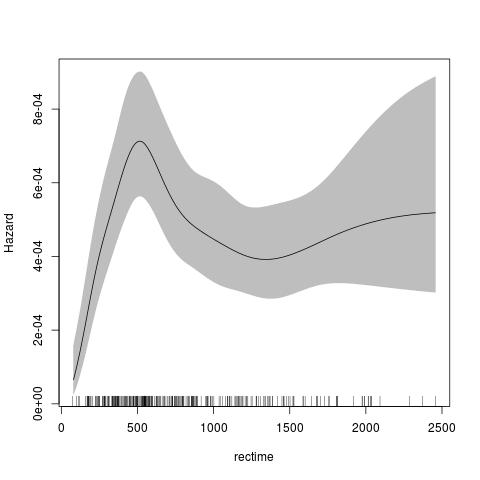

### rstpm2: An R package for link-based survival models ###

#### NOTE: versions 1.4.1 and 1.4.2 of rstpm2 included a critical bug in the predict function for type in "hr", "sdiff", "hdiff", "meansurvdiff", "meanhr", "or", "marghr" or "uncured". ####

Introduction
-----------

 

This package provides link-based survival models that extend the Royston-Parmar models, a family of flexible parametric models. There are two main classes included in this package:

 

A. The class `stpm2` is an R version of `stpm2` in Stata with some extensions, including:

1. Multiple links (log-log, -probit, -logit);

2. Left truncation and right censoring (with experimental support for interval censoring);

3. Relative survival;

4. Cure models (where we introduce the `nsx` smoother, which extends the `ns` smoother);

5. Predictions for survival, hazards, survival differences, hazard differences, mean survival, etc;

6. Functional forms can be represented in regression splines or other parametric forms;

7. The smoothers for time can use any transformation of time, including no transformation or log(time).

 

B. Another class `pstpm2` is the implementation of the penalised models and corresponding penalized likelihood estimation methods. The main aim is to represent another way to deal with non-proportional hazards and  adjust for potential continuous confounders in functional forms, not limited to proportional hazards and linear effect forms for all covariates. Functional forms can be represented in penalized regression splines (all `mgcv` smoothers ) or other parametric forms.


Some examples
-------------

<!--
require(rstpm2)
data(brcancer)
fit <- stpm2(Surv(rectime,censrec==1)~hormon,data=brcancer,df=3) jpeg(filename="~/src/R/rstpm2/inst/fig1-README.md.jpg") plot(fit,newdata=data.frame(hormon=0),type="hazard")
dev.off()
-->

The default for the parametric model is to use the Royston Parmar model, which uses a natural spline for the transformed baseline for log(time) with a log-log link. 

```
require(rstpm2)
data(brcancer)
fit <- stpm2(Surv(rectime,censrec==1)~hormon,data=brcancer,df=3)
plot(fit,newdata=data.frame(hormon=0),type="hazard")
```

<!--img src="inst/fig1-README.md.jpg" alt="(Hazard plot)" style="width:304px;height:228px;"-->


The default for the penalised model is similar, using a thin-plate spline for the transformed baseline for log(time) with a log-log link. The advantage of the penalised model is that there is no need to specify the knots or degrees of freedom for the baseline smoother.

<!--
fit <- pstpm2(Surv(rectime,censrec==1)~hormon,data=brcancer)
jpeg(filename="~/src/R/rstpm2/inst/fig2-README.md.jpg")
plot(fit,newdata=data.frame(hormon=0),type="hazard")
dev.off()
-->

```
fit <- pstpm2(Surv(rectime,censrec==1)~hormon,data=brcancer)
plot(fit,newdata=data.frame(hormon=0),type="hazard")
```


