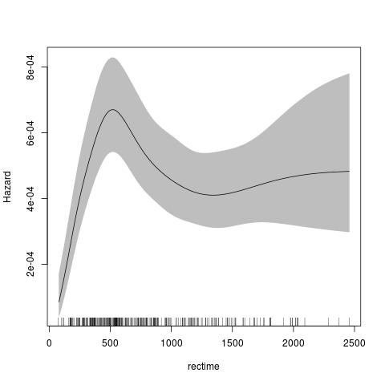

rstpm2: An R package for link-based survival models
===================================================


Introduction
-----------

This package provides link-based survival models that extend the Royston-Parmar models. This implementation provides much of the functionality of `stpm2` in Stata, including:
    1. Multiple links (log-log, probit, logit)
	2. Left truncation and right censoring (with experimental support for interval censoring for the parametric models)
	3. Relative survival
	4. Cure models (where we introduce the `nsx` smoother, which extends the `ns` smoother)
	5. Predictions for survival, hazards, survival differences, hazard differences, mean survival, etc.

The principle extensions are:
    6. Both parametric models and semi-parametric (penalised) models
    7. The parametric models can use any regression smoothers
	8. The penalised models can use any regression smoothers for the unpenalised components and any `mgcv` smoothers for the penalised components
	9. The smoothers for time can use any transformation of time, including no transformation or log(time)

The implementation speed for the parametric models are similar to that for Stata's `stpm2`. Moreover, the penalised models are fast compared with models on the log-hazard scale (e.g. `BayesX`, `gss`), particularly for many distinct covariates.


Some examples
-------------

<!--
require(rstpm2)
data(brcancer)
fit <- stpm2(Surv(rectime,censrec==1)~hormon,data=brcancer,df=3) jpeg(filename="~/src/R/rstpm2/inst/fig1-README.md.jpg") plot(fit,newdata=data.frame(hormon=0),type="hazard")
dev.off()
-->

The default for the parametric model is to use the Royston Parmar model, which uses a natural spline for the transformed baseline for log(time) with a log-log link. 

```
require(rstpm2)
data(brcancer)
fit <- stpm2(Surv(rectime,censrec==1)~hormon,data=brcancer,df=3)
plot(fit,newdata=data.frame(hormon=0),type="hazard")
```

<!--img src="inst/fig1-README.md.jpg" alt="(Hazard plot)" style="width:304px;height:228px;"-->


The default for the penalised model is similar, using a thin-plate spline for the transformed baseline for log(time) with a log-log link. 

<!--
fit <- pstpm2(Surv(rectime,censrec==1)~hormon,data=brcancer)
jpeg(filename="~/src/R/rstpm2/inst/fig2-README.md.jpg")
plot(fit,newdata=data.frame(hormon=0),type="hazard")
dev.off()
-->

```
fit <- pstpm2(Surv(rectime,censrec==1)~hormon,data=brcancer)
plot(fit,newdata=data.frame(hormon=0),type="hazard")
```


